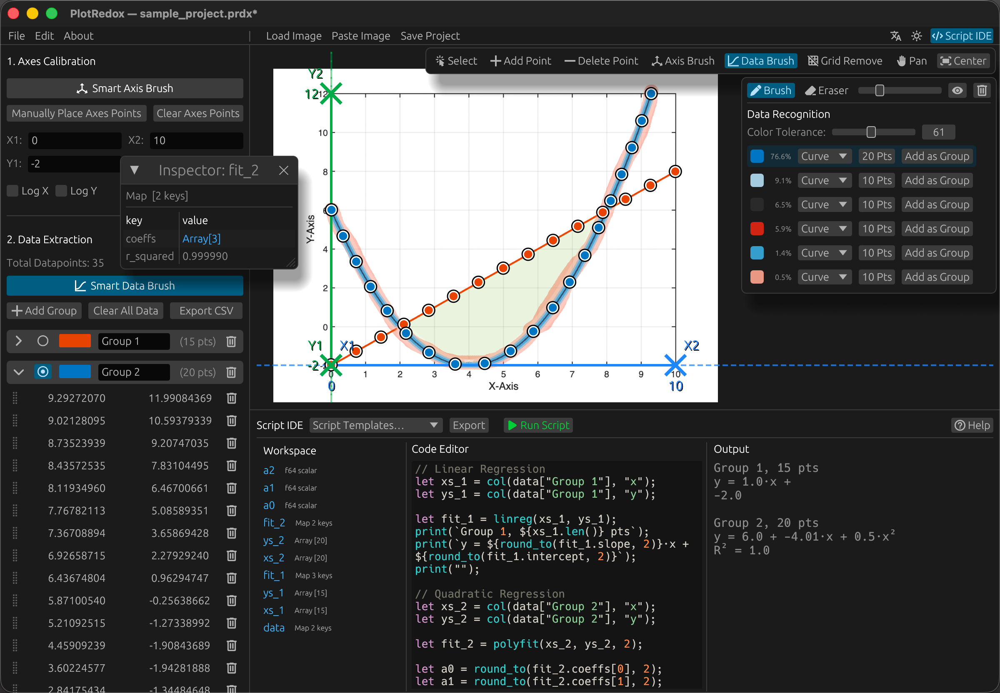

# PlotRedox

A native, high-performance chart data extraction tool built with **Rust** and **egui**. Load an image of a chart or plot, calibrate the axes, click on data points, and export the extracted coordinates to CSV — with **computer-vision-assisted recognition** and a built-in **scripting IDE** for on-the-fly data analysis.

A free and open-source alternative to [WebPlotDigitizer](https://github.com/automeris-io/WebPlotDigitizer).

English | [中文](README_zh.md)



## Features

### Core Digitizing
- Load images via file dialog, drag-and-drop, or clipboard paste
- 4-point axis calibration with support for linear and logarithmic scales
- Multiple data series (groups) with distinct colors and drag-and-drop organization
- Export extracted data to CSV
- Undo / Redo support
- Dark and light themes
- Multi-language UI (English, 中文)
- Cross-platform (Linux, macOS, Windows)

### Project Management
- **Save / Open projects** as `.prdx` files (ZIP archive containing calibration data, points, groups, and the embedded image)
- **Save As** to create copies of your project
- **New Project** with unsaved-changes protection — prompts to save before discarding work
- Window title reflects project name and dirty state
- `Ctrl+S` / `Cmd+S` quick save

### Computer Vision Recognition
Automatically detect axes and data points using mask-based computer vision, eliminating the need to click every point manually.

#### Axis Recognition
1. Switch to **Axis Mask** mode from the canvas toolbar
2. Paint a mask over the axis lines using the brush tool (pen/eraser, adjustable brush size)
3. The recognition engine detects axis lines (via directional line fitting) and tick marks
4. Review the detected X/Y axes with visual highlighting, then apply to set calibration points

#### Data Recognition
1. Switch to **Data Mask** mode from the canvas toolbar
2. (Optional) Enable **Grid Removal** in the sub-toolbar to suppress grid lines before recognition
3. Paint a mask over the data region
4. The engine performs color-based clustering to separate different data series
5. For each detected color group, choose between **Continuous** (curve sampling) or **Scatter** (point detection) mode
6. Intelligent handling of both open curves and closed shapes (circles, ellipses) via arc-length closure detection and adaptive component thinning
7. Adjust the number of sampled points and preview before adding to your dataset

#### Grid Removal
- Integrated directly into the **Data Mask** sub-toolbar — no separate mode required
- Spatial median-profile detection removes grid lines from the plot image to improve data recognition accuracy
- Adjustable strength slider (0–1) for fine-tuning
- Real-time preview with toggle to compare against original image
- Axis detection always uses the original image; grid removal only affects data recognition

All recognition modes run on background threads to keep the UI responsive. Mask painting supports Shift+Click for straight lines and constrained-axis painting (horizontal/vertical lock).

### Script IDE
- Built-in live scripting IDE powered by [Rhai](https://rhai.rs/) (Rust-embedded scripting language)
- **Script Templates** — pre-built examples ready to use:
  - Basic syntax & functions demo
  - Linear regression for all groups
  - Quadratic (polynomial) regression
  - Steinmetz parameter fitting (multi-variate OLS)
- **Workspace panel** — inspect all variables after script execution, click to view data tables
- **Import / Export** — save and load `.rhai` script files
- **Help** — built-in scripting reference with syntax guide and full API documentation

### Math & Analysis API
Scripts have access to a rich set of built-in functions:

| Category | Functions |
|----------|-----------|
| Math | `abs`, `sqrt`, `ln`, `log10`, `log2`, `exp`, `pow`, `pow10`, `sin`, `cos`, `tan`, `asin`, `acos`, `atan`, `atan2`, `floor`, `ceil`, `round`, `round_to`, `PI()` |
| Array | `sum`, `mean`, `min_val`, `max_val`, `std_dev`, `variance`, `log10_array` |
| Data | `col(array, "field")`, `extract_number(string)` |
| Regression | `linreg(x, y)`, `polyfit(x, y, degree)`, `lstsq(A, b)` |

## Roadmap & Known Issues

| Status | Item |
|--------|------|
| 🚧 In Progress | **Closed-loop / ring-shaped curve recognition** — Recent improvements (arc-length closure detection, adaptive component thinning) already handle solid circles and ellipses well, but *annular* (ring-shaped) curves remain unreliable. This is an active area of work. |

## Installation

### Download Releases
You can download pre-compiled binaries for Windows, macOS, and Linux from the [Releases](https://github.com/elechou/PlotRedox/releases) page.

> [!IMPORTANT]
> **A Note on Security & Privacy:**
> Since these binaries are not signed with expensive developer certificates, you might encounter security warnings:
> - **Windows:** "Windows protected your PC" (SmartScreen). Click *More info* → *Run anyway*.
> - **macOS:** "App cannot be opened because the developer cannot be verified". Right-click the app and select *Open*, or go to *System Settings* → *Privacy & Security*.
>
> If you prefer not to bypass these warnings, you are encouraged to audit the source code and build the application yourself locally (see below).

## Building from Source

Building from source ensures you are running the exact code present in this repository. It is the recommended method for security-conscious users.

### 1. Install Rust
If you don't have Rust installed, visit [rustup.rs](https://rustup.rs/) or run:
```bash
curl --proto '=https' --tlsv1.2 -sSf https://sh.rustup.rs | sh
```

### 2. Install System Dependencies

**Linux (Debian / Ubuntu)**
```bash
sudo apt-get update
sudo apt-get install -y libxcb-render0-dev libxcb-shape0-dev libxcb-xfixes0-dev \
    libxkbcommon-dev libssl-dev libgtk-3-dev
```

**macOS** – Xcode Command Line Tools are required: `xcode-select --install`

**Windows** – No extra dependencies are needed.

### 3. Build & Run
```bash
git clone https://github.com/elechou/PlotRedox.git
cd PlotRedox

# Run in optimized release mode
cargo run --release
```

The compiled binary will be located at `target/release/plot-redox` (or `.exe` on Windows).

## How to Use

### Step 1 – Load an image

Open the application and load a plot image:
- Click **Load Image** in the top toolbar
- **Paste** from clipboard (`Ctrl+V` / `Cmd+V` or click "Paste Image")
- Drag and drop an image file onto the window

Sample images (`sample_plot_1.png`, `sample_plot_2.png`) and a sample project (`sample_plot.prdx`) are included for testing.

### Step 2 – Calibrate the axes

**Manual calibration:**

1. Click **Place Calib Points** and click on **4 known reference points** on the image (two along X-axis, two along Y-axis).
2. Enter the real-world values for each reference point (X₁, X₂, Y₁, Y₂) in the left sidebar.
3. Enable **Log X** / **Log Y** checkboxes if an axis uses a logarithmic scale.

**Automatic calibration (CV-assisted):**

1. Switch to **Axis Mask** mode in the canvas toolbar.
2. Paint over the axis lines with the brush tool.
3. The engine detects axes and tick marks automatically.
4. Review the highlighted results, then click **Apply** to set calibration points.

### Step 3 – Extract data points

**Manual extraction:**

1. Switch to **Add Data** mode using the canvas toolbar.
2. Click on data points in the plot. Extracted coordinates appear in the left sidebar.

**Automatic extraction (CV-assisted):**

1. Switch to **Data Mask** mode in the canvas toolbar.
2. (Optional) Enable **Grid Removal** in the sub-toolbar if the plot has grid lines — adjust strength and preview the cleaned image.
3. Paint over the data region.
4. Review detected color groups — choose curve mode (Continuous/Scatter) and point count.
5. Click **Add** to import detected points into your dataset.

### Step 4 – Organize & export

- Use **Groups** to create, rename, and color-code different data series.
- Drag and drop points between groups.
- Click **Export CSV** to save all data.

### Step 5 – Save your project

- **Ctrl+S** / **Cmd+S** to save (or **File → Save Project**)
- **File → Save Project As…** to save to a new location
- Projects are saved as `.prdx` files containing all data and the embedded image

### Step 6 – Analyze with scripts

1. Click **Script IDE** in the top-right corner to open the IDE panel.
2. Select a template from **Script Templates** or write your own Rhai script.
3. Click **▶ Run Script** to execute. Results appear in the Output panel; variables appear in the Workspace panel.
4. Click **ⓘ Help** for the full API reference and syntax guide.

## Keyboard Shortcuts

| Shortcut | Action |
|---|---|
| `Ctrl+S` / `Cmd+S` | Save project |
| `Ctrl+Z` / `Cmd+Z` | Undo |
| `Ctrl+Shift+Z` / `Cmd+Shift+Z` | Redo |
| `Ctrl+V` / `Cmd+V` | Paste image from clipboard |
| `Delete` / `Backspace` | Delete selected points |
| `Arrow keys` | Nudge selected points |
| `Escape` | Cancel current mode |
| `Shift+Click` | Range select / straight line (in mask mode) |
| `Ctrl+Click` / `Cmd+Click` | Toggle individual selection |

## Customizing Built-in Scripts

PlotRedox features a powerful **auto-discovery system** for script templates. You are not limited to the presets provided in the repository; you can easily add your own permanent code snippets to the IDE.

### How it Works
The build system (`build.rs`) automatically scans the `example_scripts/` directory during compilation and embeds every `.rhai` file it finds directly into the application's binary. This means your personal analysis scripts will appear in the **Script Templates** menu just like the built-in ones.

### Adding Your Own Scripts
1.  Navigate to the `example_scripts/` folder in the root of the repo.
2.  Create a new `.rhai` file (e.g., `my_custom_filter.rhai`).
3.  **Re-compile** the application using `cargo run --release`.

#### Tips for Organization
- **Menu Order**: Files are sorted alphabetically. Use numeric prefixes like `01_load_data.rhai`, `02_clean_data.rhai` to control the exact order in the dropdown menu.
- **Display Names**: The system automatically "prettifies" filenames for the UI. For example, `03_advanced_log_fit.rhai` will be displayed as **"Advanced Log Fit"** in the IDE.

## Project Structure

```
PlotRedox/
├── src/
│   ├── main.rs              # Application entry point & eframe lifecycle
│   ├── action.rs            # Action enum definitions
│   ├── action_handler.rs    # Core dispatch logic (Action → State mutation)
│   ├── core.rs              # Calibration math and coordinate mapping
│   ├── state.rs             # Runtime state & serializable project data
│   ├── project.rs           # Project save/load (.prdx ZIP format)
│   ├── i18n.rs              # Internationalization (English / Chinese)
│   ├── icons.rs             # Nerd Font icon constants
│   ├── ui/                  # UI layer (canvas, panels, toolbars, modals)
│   ├── ide/                 # Script IDE (editor, workspace, inspector, help)
│   ├── script/              # Rhai scripting engine & math functions
│   └── recognition/         # CV recognition (axis, data, mask, grid removal)
├── assets/                  # App icon + fonts (Sarasa UI SC for CJK)
├── example_scripts/         # Built-in script templates (.rhai)
├── docs/                    # Scripting reference (English & Chinese)
├── build.rs                 # Script embedding, font subsetting, Windows icon
├── build_font_subset.rs     # CJK font subsetting logic
├── Cargo.toml               # Dependencies and build configuration
└── screenshot.png           # Application screenshot
```

## Third-Party Licenses

- **Sarasa UI SC** — Used for Chinese character rendering. Licensed under the [SIL Open Font License 1.1](https://scripts.sil.org/OFL). Source: [Sarasa Gothic](https://github.com/be5invis/Sarasa-Gothic).

## License

This project is licensed under the [MIT License](LICENSE).
